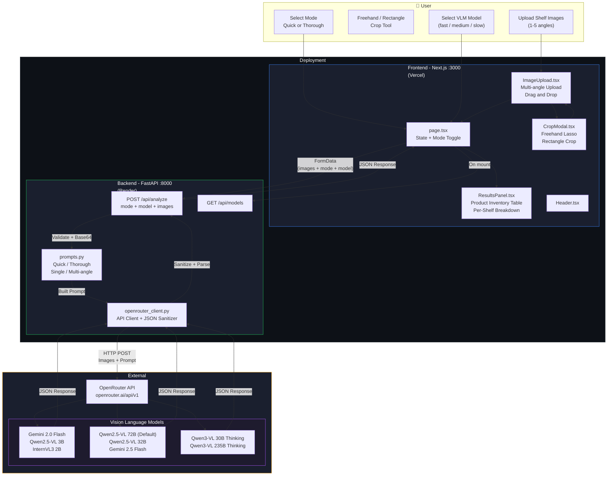
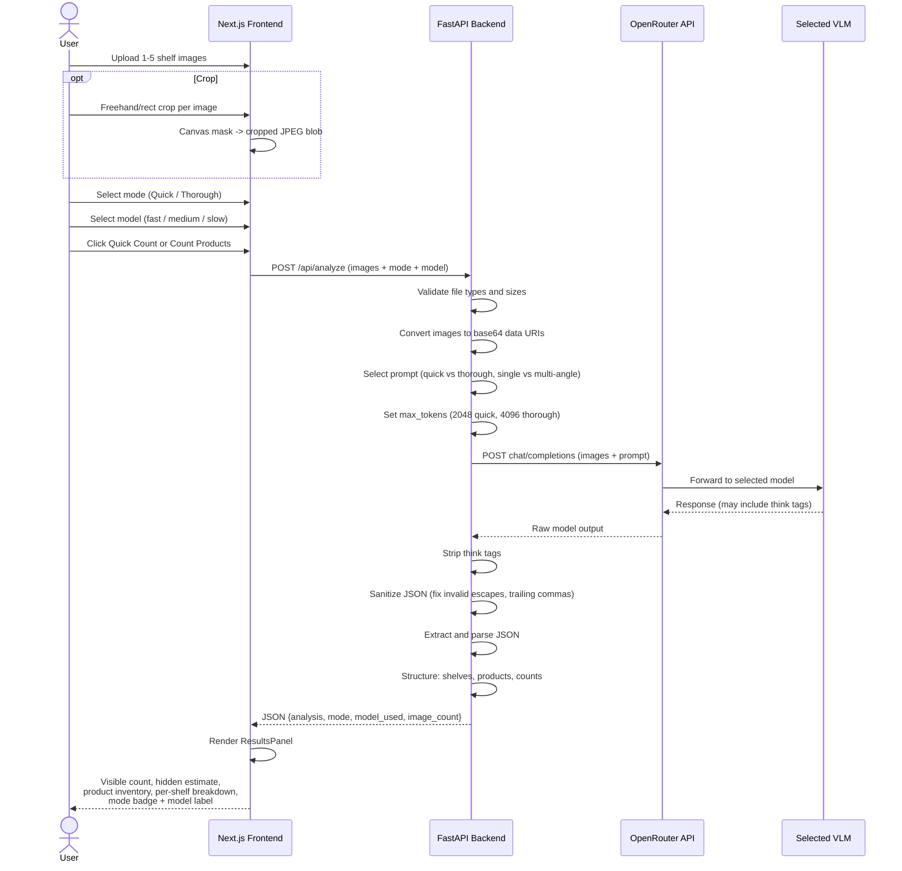
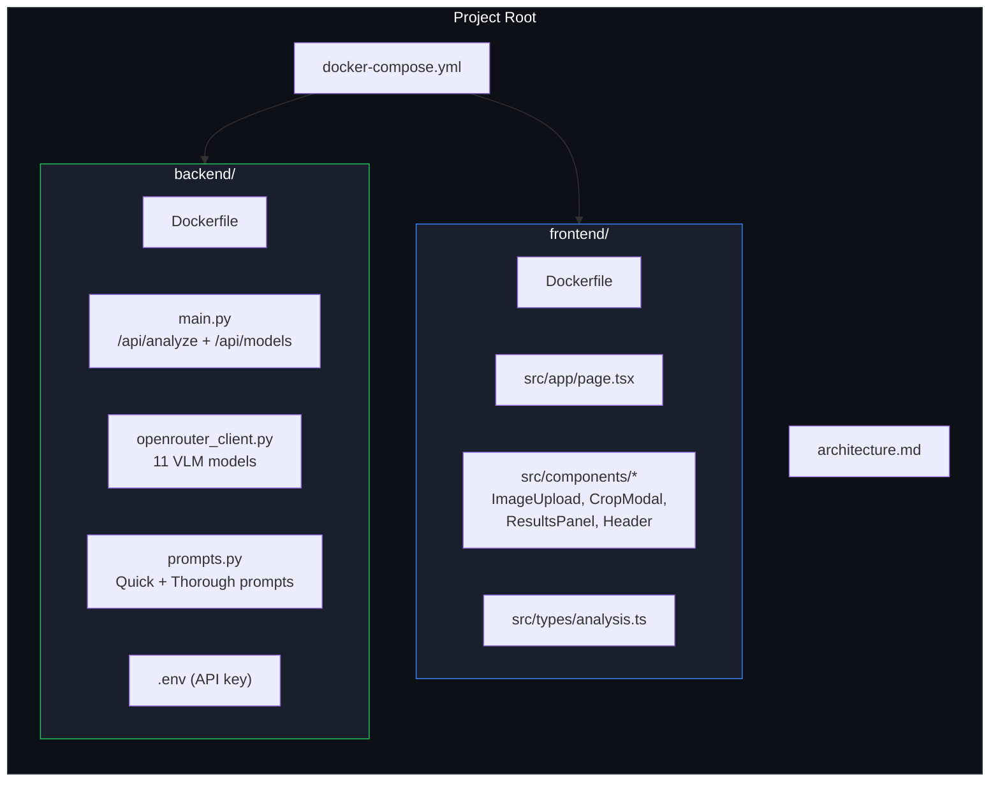

## System Architecture

```mermaid
flowchart TB
    subgraph User["👤 User"]
        Upload["Upload Shelf Images<br/>(1-5 angles)"]
        Crop["Freehand / Rectangle<br/>Crop Tool"]
        Mode["Select Mode<br/>Quick or Thorough"]
        ModelPick["Select VLM Model<br/>(fast / medium / slow)"]
    end

    subgraph Infra["Deployment"]
        subgraph FE["Frontend - Next.js :3000<br/>(Vercel)"]
            Page["page.tsx<br/>State + Mode Toggle"]
            IU["ImageUpload.tsx<br/>Multi-angle Upload<br/>Drag and Drop"]
            CM["CropModal.tsx<br/>Freehand Lasso<br/>Rectangle Crop"]
            RP["ResultsPanel.tsx<br/>Product Inventory Table<br/>Per-Shelf Breakdown"]
            Header["Header.tsx"]
        end

        subgraph BE["Backend - FastAPI :8000<br/>(Render)"]
            APIAnalyze["POST /api/analyze<br/>mode + model + images"]
            APIModels["GET /api/models"]
            Prompts["prompts.py<br/>Quick / Thorough<br/>Single / Multi-angle"]
            ORC["openrouter_client.py<br/>API Client + JSON Sanitizer"]
        end
    end

    subgraph External["External"]
        OR["OpenRouter API<br/>openrouter.ai/api/v1"]
        subgraph Models["Vision Language Models"]
            Fast["Gemini 2.0 Flash<br/>Qwen2.5-VL 3B<br/>InternVL3 2B"]
            Medium["Qwen2.5-VL 72B (Default)<br/>Qwen2.5-VL 32B<br/>Gemini 2.5 Flash"]
            Slow["Qwen3-VL 30B Thinking<br/>Qwen3-VL 235B Thinking"]
        end
    end

    Upload --> IU
    IU --> CM
    CM --> IU
    Mode --> Page
    ModelPick --> Page
    IU --> Page

    Page -->|"FormData<br/>(images + mode + model)"| APIAnalyze
    Page -->|"On mount"| APIModels
    APIAnalyze -->|"Validate + Base64"| Prompts
    Prompts -->|"Built Prompt"| ORC
    ORC -->|"HTTP POST<br/>Images + Prompt"| OR
    OR --> Fast
    OR --> Medium
    OR --> Slow
    Fast -->|"JSON Response"| ORC
    Medium -->|"JSON Response"| ORC
    Slow -->|"JSON Response"| ORC
    ORC -->|"Sanitize + Parse"| APIAnalyze
    APIAnalyze -->|"JSON Response"| Page
    Page --> RP

    style Infra fill:#0d1117,stroke:#30363d,color:#fff
    style FE fill:#1a1f2e,stroke:#3b82f6,color:#fff
    style BE fill:#1a1f2e,stroke:#22c55e,color:#fff
    style External fill:#1a1f2e,stroke:#f59e0b,color:#fff
    style Models fill:#1e1b2e,stroke:#a855f7,color:#fff
```

### Data Flow

```mermaid
sequenceDiagram
    actor U as User
    participant FE as Next.js Frontend
    participant BE as FastAPI Backend
    participant OR as OpenRouter API
    participant VLM as Selected VLM

    U->>FE: Upload 1-5 shelf images
    opt Crop
        U->>FE: Freehand/rect crop per image
        FE->>FE: Canvas mask -> cropped JPEG blob
    end
    U->>FE: Select mode (Quick / Thorough)
    U->>FE: Select model (fast / medium / slow)
    U->>FE: Click Quick Count or Count Products

    FE->>BE: POST /api/analyze (images + mode + model)

    BE->>BE: Validate file types and sizes
    BE->>BE: Convert images to base64 data URIs
    BE->>BE: Select prompt (quick vs thorough, single vs multi-angle)
    BE->>BE: Set max_tokens (2048 quick, 4096 thorough)

    BE->>OR: POST chat/completions (images + prompt)
    OR->>VLM: Forward to selected model
    VLM-->>OR: Response (may include think tags)
    OR-->>BE: Raw model output

    BE->>BE: Strip think tags
    BE->>BE: Sanitize JSON (fix invalid escapes, trailing commas)
    BE->>BE: Extract and parse JSON
    BE->>BE: Structure: shelves, products, counts

    BE-->>FE: JSON {analysis, mode, model_used, image_count}

    FE->>FE: Render ResultsPanel
    FE-->>U: Visible count, hidden estimate,<br/>product inventory, per-shelf breakdown,<br/>mode badge + model label
```

### Project Structure

```mermaid
graph LR
    subgraph Root["Project Root"]
        DC["docker-compose.yml"]
        Arch["architecture.md"]
        subgraph FDir["frontend/"]
            DF1["Dockerfile"]
            Src["src/app/page.tsx"]
            Comp["src/components/*<br/>ImageUpload, CropModal,<br/>ResultsPanel, Header"]
            Types["src/types/analysis.ts"]
        end
        subgraph BDir["backend/"]
            DF2["Dockerfile"]
            Main["main.py<br/>/api/analyze + /api/models"]
            ORC2["openrouter_client.py<br/>11 VLM models"]
            PR["prompts.py<br/>Quick + Thorough prompts"]
            Env[".env (API key)"]
        end
    end

    DC --> FDir
    DC --> BDir

    style Root fill:#0d1117,stroke:#30363d,color:#fff
    style FDir fill:#1a1f2e,stroke:#3b82f6,color:#fff
    style BDir fill:#1a1f2e,stroke:#22c55e,color:#fff
```
